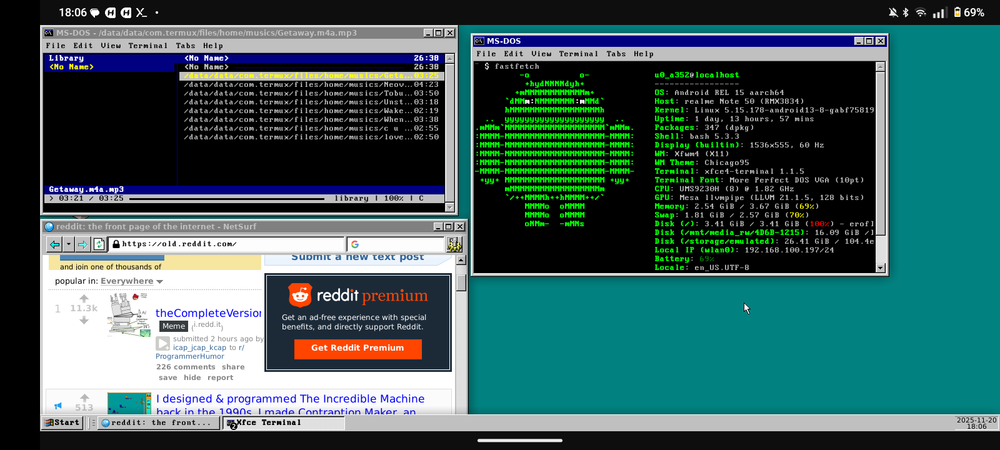

# Chicago95
#### XFCE Windows 95 Total Conversion (this is a fork for termux)

I was unhappy with the various XFCE/GTK2/GTK3 Windows 95 based themes and decided to make one that was more consistent across the board for theming.

### Included in this theme:

- Icons to complete the icon theme started with Classic95
- GTK2 and GTK3 themes
- Edited Redmond XFWM theme to more accurately reflect Windows 95
- An MS-DOS inspired theme for oh-my-zsh

### Requirements:

- GTK+ 3.22 or 3.24
- Xfce 4.12, 4.14, 4.16
- gtk2-engines-pixbuf (Recommended for GTK2 applications)
- The xfce4-panel-profiles package
- A Window compositor
-----

## Installation

[Click here](INSTALL.MD) for installation guide
----
## Special Thanks
 - [Chicago95 - The original project](https://github.com/grassmunk/Chicago95)
----
### Code and license
License: MIT
